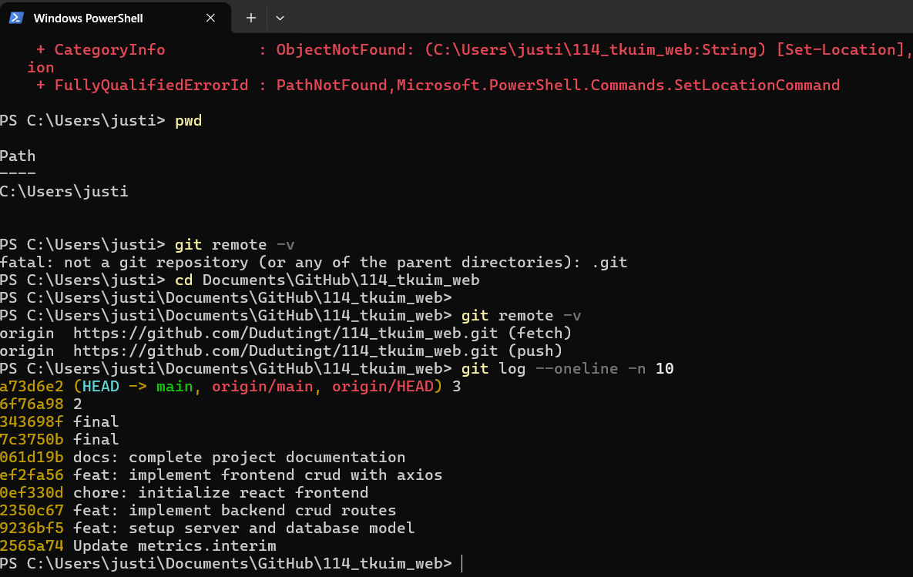

#  Idea Oasis (靈感綠洲) - 全端個人內容管理系統 (Full-Stack CMS)

**資管3C 杜駿珽 412630997**

##  專案簡介
在數位資訊爆炸的時代，靈感往往轉瞬即逝。「靈感綠洲」旨在提供一個純淨、高效的空間，讓創作者能隨時隨地捕捉每一閃而過的創意。本專案採用 **MERN (MongoDB, Express, React, Node.js)** 架構實作，是一個完整的全棧 (Full-stack) 管理平台，並將所有數據持久化儲存於 MongoDB Atlas 雲端資料庫。

## 系統架構與流程圖 (Architecture & Workflow)
本系統採用標準三層式架構設計，確保資料流 (Data Flow) 的穩定性與安全性：

### 系統架構
1. **Frontend (展示層)**: 使用 React 元件化開發，透過 Axios 負責與後端進行非同步通訊。
2. **Backend (邏輯層)**: 基於 Node.js 與 Express 建立 RESTful API，處理資料驗證與業務邏輯。
3. **Database (資料層)**: 使用 MongoDB Atlas 雲端資料庫，透過 Mongoose 定義 Schema 進行結構化儲存。

### 操作流程
- **使用者操作**: 於前端介面輸入靈感標題與內容並點擊按鈕。
- **發送請求**: 前端發送 HTTP 請求 (POST/GET/PUT/DELETE) 至後端。
- **資料持久化**: 後端透過 Mongoose 對 MongoDB 執行 CRUD 操作。
- **UI 更新**: 請求成功後，前端 React 狀態 (State) 立即更新，使用者可即時看到結果。

---

##  技術選型
- **前端**: React.js (Vite), Axios, Lucide React
- **後端**: Node.js, Express, Mongoose
- **資料庫**: MongoDB Atlas (Cloud NoSQL)
- **版本控制**: Git (GitHub)

---

## 資料庫模型設計 (Data Schema)
我們定義了 `Idea` 模型，確保每一筆靈感資料的完整性：

| 欄位名稱 | 類型 | 必填 | 說明 |
| :--- | :--- | :--- | :--- |
| `title` | String |  | 靈感標題 |
| `content` | String |  | 詳細內容描述 |
| `mood` | String | 預設 |  (心情標籤) |
| `createdAt` | Date | 自動 | 系統自動生成建立時間 |
| `updatedAt` | Date | 自動 | 系統自動記錄最後修改時間 |

---

## 📄 API 規格文件 (API Specification)
**Base URL:** `http://localhost:5000/api/ideas`

| 功能名稱 | HTTP 方法 | 端點 (Route) | 請求主體 (Request Body) | 預期回應 |
| :--- | :--- | :--- | :--- | :--- |
| **讀取所有靈感** | `GET` | `/` | 無 | `200 OK` (返回陣列) |
| **新增靈感** | `POST` | `/` | `{ "title", "content" }` | `201 Created` |
| **修改靈感內容** | `PUT` | `/:id` | `{ "title", "content" }` | `200 OK` |
| **刪除靈感** | `DELETE` | `/:id` | 無 | `200 OK` |

---

## 📺 專題操作 Demo 影片
影片包含：環境展示、完整 CRUD 功能示範（新增、讀取、更新、刪除）、以及 MongoDB 雲端同步驗證。
 **[觀看展示影片](https://youtu.be/uell60xK3AQ?si=DVHKT2aVoq2knexb)**

---

##  安裝與執行指引
1. **後端設定**: 進入 `backend` 目錄執行 `npm install`，並於 `.env` 設定 `MONGO_URI`。
2. **啟動後端**: 執行 `npx nodemon server.js`。
3. **前端設定**: 進入 `frontend` 目錄執行 `npm install`。
4. **啟動前端**: 執行 `npm run dev` 並訪問顯示網址。

---

##  開發驗證與 Git 紀錄
本專案嚴格遵循版本控制規範，於本機路徑 `C:\Users\justi\Documents\GitHub\114_tkuim_web` 完成開發並推送至遠端倉庫 `Dudutingt/114_tkuim_web.git`。目前 Commit 紀錄已達 10 次以上，包含關鍵里程碑：

- `feat: setup server and database model`
- `feat: implement backend crud routes`
- `feat: implement frontend crud with axios`
- `docs: complete project documentation`